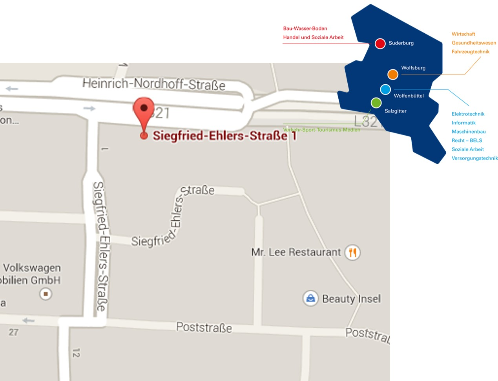
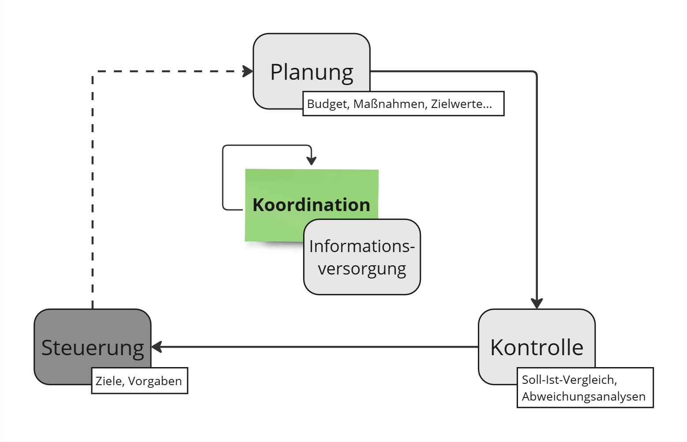

class: inverse, center, middle


<!--html_preserve--><style>.xe__progress-bar__container {
  bottom:0;
  opacity: 1;
  position:absolute;
  right:0;
  left: 0;
}
.xe__progress-bar {
  height: 0.25em;
  background-color: lightgrey;
  width: calc(var(--slide-current) / var(--slide-total) * 100%);
}
.remark-visible .xe__progress-bar {
  animation: xe__progress-bar__wipe 200ms forwards;
  animation-timing-function: cubic-bezier(.86,0,.07,1);
}
@keyframes xe__progress-bar__wipe {
  0% { width: calc(var(--slide-previous) / var(--slide-total) * 100%); }
  100% { width: calc(var(--slide-current) / var(--slide-total) * 100%); }
}</style><!--/html_preserve-->


<style type="text/css">
.infobox{
    text-align: left; 
    background-color: #1f4257; 
    color: white;
    padding-left: 10px;
    padding-right: 5px;
    padding-top: 0px;
    padding-bottom: 0px;
    line-height: 1.2;

}

.solveme1{
    background-color: #1f4257; 
    color: white;
    padding-left: 5px;
    padding-right: 5px;
    font-weight: bold;
    line-height: 1.2;
}


.solveme{
    background-color: #F2F2F2; 

}


i { /* macht alles was mit <i> Tag versehen wurde unsichtbar. */
  color: #F2F2F2;
  background-color: #F2F2F2;
}


.footer {
    composes: remark-slide-number;
    left: 20px;
    position: absolute;
    bottom: 12px;
    font-size: 0.9rem;
}

.right-column{
  padding-top: 0;
}

.footnote{
  font-size: 13px;
}

/* Druckverhalten */
/* Standardanzeige (Bildschirm) */
.only-print {
  display: none;
}

/* Anzeige nur beim Drucken */
@media print {
  .only-print {
    display: block;
  }
}


@media print{
  .hide-in-print{
    display: none !important;
  }
}


.container {
  display: flex;
}

.col {
  flex: 1; /* Alle Spalten gleich breit */
  padding: 10px;
}

.fullscreen {
  padding: 0 !important;
  margin: 0 !important;

}


h4 {
  font-size: 1.5rem;
  font-weight: 600;
  color: var(--header-color);
}


h5 {
  font-size: 1.25rem;
  font-weight: 600;
  color: var(--header-color);
}

</style>


<style type="text/css">
/* Allgemeine Tabellen-Stile */
table {
  border-collapse: collapse; /* Verhindert doppelte Linien */
  width: 100%; /* Tabelle nimmt die gesamte Breite ein */
  margin: 20px 0; /* Abstand über und unter der Tabelle */
  font-family: Arial, sans-serif; /* Schriftart */
  font-size: 14px; /* Schriftgröße */
}

/* Tabellenzellen mit Rahmen versehen */
table th, table td {
  border: 1px solid #ddd; /* Dünne graue Linien für Zellen */
  padding: 8px; /* Innenabstand der Zellen */
}

/* Header-Stil */
table th {
  background-color:lightgrey; /* Graue Hintergrundfarbe für den Header #f2f2f2;*/
  text-align: left; /* Textausrichtung im Header immer links */
  font-weight: bold; /* Fettgedruckte Schrift im Header */
}

/* Alternierende Zeilenfarben für bessere Lesbarkeit (optional) */
table tr:nth-child(even) {
  background-color: pink;
}


</style>


# <!--html_preserve--><svg aria-hidden="true" role="img" viewBox="0 0 448 512" style="height:1em;width:0.88em;vertical-align:-0.125em;margin-left:auto;margin-right:auto;font-size:inherit;fill:currentColor;overflow:visible;position:relative;"><path d="M152 24c0-13.3-10.7-24-24-24s-24 10.7-24 24V64H64C28.7 64 0 92.7 0 128v16 48V448c0 35.3 28.7 64 64 64H384c35.3 0 64-28.7 64-64V192 144 128c0-35.3-28.7-64-64-64H344V24c0-13.3-10.7-24-24-24s-24 10.7-24 24V64H152V24zM48 192H400V448c0 8.8-7.2 16-16 16H64c-8.8 0-16-7.2-16-16V192z"/></svg><!--/html_preserve-->

# “Prognosen sind schwierig, besonders wenn sie die Zukunft betreffen."

--
(unbekannt)

<!-- Layout on------------------------------------------------------------------ Start new Slide  -->
---
layout: true
.footer[0 | Intro]

<!--------------------------------------------------------------------- Start new Slide  -->
---
class: animated slideInRight fadeOutLeft


# Kontakt & Sprechstunde

.left-column[ 
**Peter von Holten**

<b>Wissenschaftlicher Mitarbeiter</b>
<hr> <div style="border-top: 10px solid white"></div>
<b>Doktorand</b>


]

--

.right-column[ .column[.pull-right[]]
<br>
**Fakultät Wirtschaft**<br>
Siegfried-Ehlers-Str. 1<br>
Gebäude E | Raum E-311 <br>
38440 Wolfsburg<br><br><br><br>

E-Mail: <mailto:p.vonHolten@ostfalia.de><br><br>


<div style="border-top: 0px solid white"></div>


.infobox[Sprechstundentermine sind flexibel vereinbar.<br>
👉 Abstimmung per E-Mail.]

.infobox[Abgrenzbare (und entsprechend ausformulierte) Fragen können oft auch direkt per E-Mail geklärt werden.
 Ich werde solche Anfragen priorisiert bearbeiten. 🚀]


]
<!--------------------------------------------------------------------- Start new Slide  -->
---


# Kompetenzziele
>Die Studierenden kennen die **operativen und strategischen Ansätze** des Controllings. Sie können die **Controlling-Organisation** im
Unternehmen einschätzen und operative **Handlungshinweise** als Dienstleister geben. Die Studierenden beherrschen die wesentlichen
operativen Instrumente des Controllings und können sie situationsadäquat einsetzen.

<br>
>Die Lehrveranstaltung soll die Methodenkompetenz durch das **Denken in Zusammenhängen** und die **selbständige Beurteilung
betriebswirtschaftlicher Fragestellungen** im Zusammenhang mit der erfolgswirtschaftlichen Unternehmenssteuerung fördern. Darüber hinaus
werden im Rahmen der Veranstaltung **analytische Fähigkeiten und abstraktes Denken** geschult.


.footnote[**vgl. Modulhandbuch Betriebswirtschaftslehre (B.A.):** https://studium.ostfalia.de/fileadmin/user_upload/Fakultaeten/w/fakw_Modulbeschreibungen_BWL_PO2019_03_2024.pdf]
<!--------------------------------------------------------------------- Start new Slide  -->
---


# Lehrinhalte
>Begriff, Aufgaben, Anforderungen und Organisation des Controllings; Instrumente des operativen Controlling: Deckungsbeitrags und
Plankostenrechnung, Erlös -, Einzelkosten- und Gemeinkostenabweichungsanalysen, integrierte finanzielle Gesamtplanung (Budgetierung),
Kennzahlen und Kennzahlensysteme, Break-Even-Analyse, Berichtswesen.

# Methoden
>Vorlesung mit integrierten Übungsanteilen. Es werden konkrete Arbeitsaufträge für das Zeitbudget des Selbststudiums erteilt. Diese
umfassen vor allem ein begleitendes Studium der als relevant ausgewiesenen Literatur sowie zusätzliche Übungsaufgaben. Die Erledigung dieser vorlesungsbegleitenden Aufgaben wird durch entsprechende Aufgabenstellungen in der Klausur sichergestellt. 

.footnote[**vgl. Modulhandbuch Betriebswirtschaftslehre (B.A.):** https://studium.ostfalia.de/fileadmin/user_upload/Fakultaeten/w/fakw_Modulbeschreibungen_BWL_PO2019_03_2024.pdf]
<!--------------------------------------------------------------------- Start new Slide  -->
---


# Ablaufplan


.pull-left[
### Inhalte
<hr>
<div style="font-size: 18px; line-height:170%;">
<b>Kapitel 1:</b> Einführung in das Controlling
<br>
<b>Kapitel 2:</b> Controlling-Organisation
<br>
<b>Kapitel 3:</b> Grundlagen der Kostenrechnung
<br>
<b>Kapitel 4:</b> Planungs- und Kontrollsysteme
<br>
<b>Kapitel 5:</b> Deckungsbeitragsrechnung
<br>
<b>Kapitel 6:</b> Plankostenrechnung
<br>
<b>Kapitel 7:</b> Abweichungsanalysen
<br>
<b>Kapitel 8:</b> Dezentrales Erfolgscontrolling
<br>
<b>Kapitel 9:</b> Zielsysteme im Controlling
<br>
<b>Kapitel 10:</b> Kennzahlen und Kennzahlensysteme
<br>
<b>Kapitel 11:</b> Wertorientiertes Controlling

</div>
]


.pull-right[
### Termine
<hr>
<div style="font-size: 18px; line-height:170%;">
14.03.2025 | <b>C-227</b>
<br>
21.03.2025 | <b>C-227</b>
<br>
28.03.2025 | <b>C-227</b>
<br>
04.04.2025 | <b>C-227</b>
<br>
11.04.2025 | <b>C-227</b>
<br><span style="color: red;">
18.04.2025 | <b>Feiertag entfällt</b>
<br></span>
25.04.2025 | <b>C-227</b>
<br><span style="color: steelblue;">
02.05.2025 | <b>Brückentag Online🌍 <a href="https://moodle.ostfalia.de/mod/bigbluebuttonbn/view.php?id=403510">(Link)</a> 
<br></b></span> 
09.05.2025 | <b>C-227</b>
<br>
16.05.2025 | <b>C-227</b>
<br>
23.05.2025 | <b>C-227</b>
<br><span style="color: steelblue;">
30.05.2025 | <b>Brückentag Online 🌍 <a href="https://moodle.ostfalia.de/mod/bigbluebuttonbn/view.php?id=403510">(Link)</a> 
<br></b></span> 
06.06.2025 | <b>C-227</b>


</div>]


<!--------------------------------------------------------------------- Start new Slide  -->
---


# 📆 Angebot: Veranstaltungskalender als iCal-Abo 

**<span style="background-color: #1f4257; color: white;padding-left: 10px;padding-right: 5px;">Für diese Vorlesung steht der Veranstaltungskalender als iCal-Abo bereit:</span>**

>**ACHTUNG: Die iCal-Abonnements befinden sich im Beta-Test**. 
<br><small>Es wird keinerlei Gewähr für deren reibungslose Funktion übernommen. Offiziell gültig ist immer nur der Stundenplan unter<u> [**https://stundenplan.ostfalia.de/**](https://stundenplan.ostfalia.de/)</u> sowie die Mitteilungen unter <u>[**Vorlesungsausfälle & Nachholveranstaltungen**](https://moodle.ostfalia.de/mod/forum/view.php?id=372374)</U> im Infopoint der Fak. Wirtschaft.</small>


--

<br>
**<span style="background-color: #1f4257; color: white;padding-left: 10px;padding-right: 5px;">Wie funktioniert das?</span>**

👉 [**Hier klicken**](webcal://powerfolder.sonia.de/dl/fi6yHDwsrjZJ1FizwGPKZ1/Kalenderdateien_Veranstaltungen/Controlling-Instrumente.iCal) und das Abonnieren der Updates bestätigen.<br>

Alternativ, falls dies nicht funktioniert:

1. **Den folgenden Link kopieren (nicht öffnen!):**</b>
<span style="word-break: break-all;">
```https:powerfolder.sonia.de/dl/fi6yHDwsrjZJ1FizwGPKZ1/Kalenderdateien_Veranstaltungen/Controlling-Instrumente.iCal
```</span>

2. **Den Link im Kalenderprogramm als Kalenderabonnement hinzufügen** (ggf. heißt der Menüpunkt Internetkalender oder ähnlich, je nach Programm). Das funktioniert auch auf dem Smartphone.


<!--------------------------------------------------------------------- Start new Slide  -->
---


# Skript
>Das Skript wird laufend aktualisiert und in Inkrementen im Nachgang jeder Veranstaltung zur Verfügung gestellt. 

> Übungsaufgaben werden spätestens einen Tag vor der Veranstaltung bereitgestellt.<br> 
👉 **Ich empfehle dringend etwaige Lösungsblätter auszudrucken und auf Papier zu arbeiten!!!**


# Literatur

- **Brühl, R. (2016):** Controlling, München

- **Horvath, P./Gleich, R./Seiter, M. (2019):** Controlling, 14. Aufl., München

- **Huch, B./ Behme , W./Ohlendorf, T. (2004):** Rechnungswesen orientiertes Controlling, 4. Aufl., Heidelberg

- **Weber, J./Schäffer, U. (2020):** Einführung in das Controlling, 16. Aufl., Stuttgart


<!--------------------------------------------------------------------- Start new Slide  -->
---


# Factsheet
.left-column[ 
**Präsenzvorlesungen**
<br><br><br>
**Modus**
<br><br><br><br><br><br>
**Prüfung**


] .right-column[
Die Veranstaltungen finden in Präsenz im **Raum C-227** statt. <br>👉 Ausnahmen hiervon finden sich in der Terminübersicht.
<br><br>
Vermittlung von Inhalten mit interaktiven Elementen.<br>👉 **Input > Übungsaufgabe > Feedback > Input...**<br><br>
.infobox[Bitte nutzen Sie die Chance und rechnen Sie mit. (Ich kann das schon.)]</b>
<br><br><br>
**Klausur (90 Minuten)**
- Die Klausur wird einen erheblichen Anteil ähnlicher Aufgabenstellungen wie die Übungsaufgaben umfassen.
- **Darüber hinaus sind auch alle anderen Inhalte relevant!**


.infobox[
Für die Prüfung sind ausschließlich Casio-Taschenrechner aus den Reihen fx-82 und fx-85 zugelassen.👉 Alle anderen Geräte entsprechend nicht!
]

]

<!--------------------------------------------------------------------- Start new Slide  -->
---
class: center, middle


## Warum haben Sie Controlling als Vertiefung gewählt?


<b> https://miro.com/app/board/uXjVLhC_0pk=/?moveToWidget=3458764616504825772&cot=14  </b>

<!--------------------------------------------------------------------- Start new Slide  -->
---


<iframe class=hide-in-print width="100%" height="90%" loading="lazy" src="https://miro.com/app/live-embed/uXjVLhC_0pk=/?moveToWidget=3458764616504825772&cot=14&autoplay=true" frameborder="0" scrolling="no" allow="fullscreen; clipboard-read; clipboard-write" allowfullscreen></iframe>

.only-print[
### Diese Folie fehlt nicht im Export: Hier waren wir auf Miro unterwegs...
👉 https://miro.com/app/live-embed/uXjVLhC_0pk=/?moveToWidget=3458764616504825772&cot=14
]
<!--1️⃣❗❗❗------------------------------------------------------------------- Start new Slide  -->
---
layout: false
class: inverse, center, middle


# <!--html_preserve--><svg aria-hidden="true" role="img" viewBox="0 0 576 512" style="height:1em;width:1.12em;vertical-align:-0.125em;margin-left:auto;margin-right:auto;font-size:inherit;fill:currentColor;overflow:visible;position:relative;"><path d="M575.8 255.5c0 18-15 32.1-32 32.1h-32l.7 160.2c0 2.7-.2 5.4-.5 8.1V472c0 22.1-17.9 40-40 40H456c-1.1 0-2.2 0-3.3-.1c-1.4 .1-2.8 .1-4.2 .1H416 392c-22.1 0-40-17.9-40-40V448 384c0-17.7-14.3-32-32-32H256c-17.7 0-32 14.3-32 32v64 24c0 22.1-17.9 40-40 40H160 128.1c-1.5 0-3-.1-4.5-.2c-1.2 .1-2.4 .2-3.6 .2H104c-22.1 0-40-17.9-40-40V360c0-.9 0-1.9 .1-2.8V287.6H32c-18 0-32-14-32-32.1c0-9 3-17 10-24L266.4 8c7-7 15-8 22-8s15 2 21 7L564.8 231.5c8 7 12 15 11 24z"/></svg><!--/html_preserve-->
# 1 Einführung in das Controlling
--

<b>  [Aufgaben, Funktionen und Begriff des Controllings]   </b>
<!-- Layout on------------------------------------------------------------------ Start new Slide  -->
---
layout: true
.footer[1 | Einführung in das Controlling]
<!--------------------------------------------------------------------- Start new Slide  -->
---


# 1 Einführung in das Controlling
.bg-light-gray.pl1[
## Lernziele 🚀]


.pull-left.pl2[
<div style="border-top: 15px solid white"></div>

<big> 
Aufgaben und Anforderungen im Controlling
<div style="border-top: 30px solid white"></div>
...
<div style="border-top: 30px solid white"></div>
Funktionen des Controllings
<div style="border-top: 30px solid white"></div>
...
<div style="border-top: 30px solid white"></div>
Was ist Controlling?

</big>


]


.pull-right[


.infobox.pl1.white[<b>Fragen, die wir beantworten wollen:</b><i>
- Was ist der Unterschied zwischen Controlling und Management?
- Was macht das Controlling überhaupt?
- Was hat Kontrolle mit Controlling zu tun?
- Braucht man das überhaupt? 
- Warum ist das wichtig?
- Was macht den Controlling-Prozess aus?
- Wozu benötigt man Controlling?
- Was sind typische Aufgaben im Controlling?
- Was wird von Controllern in der Praxis erwartet?
- Welche Eigenschaften müssen sie haben?
<br>...<br>.light-gray[]


]

]


<!--------------------------------------------------------------------- Start new Slide  -->
---

# Aufgaben im Controlling

<b>   Leitbild der International Group of Controlling (IGC) aus dem Jahr 2013:<sup>*</sup>     </b>
>Controller leisten als **Partner des Managements** einen wesentlichen Beitrag zum nachhaltigen Erfolg der Organisation.
Controller …<br>
<div style="font-size: 20px; line-height:110%;">

>- ...**gestalten und begleiten den Management-Prozess der Zielfindung, Planung und Steuerung**, sodass jeder Entscheidungsträger zielorientiert handelt.<br><br>
- ...sorgen für die **bewusste Beschäftigung mit der Zukunft** und ermöglichen dadurch, Chancen wahrzunehmen und mit
Risiken umzugehen.<br><br>
- ...**integrieren die Ziele und Pläne aller Beteiligten** zu einem abgestimmten Ganzen.<br><br>
- ...**entwickeln und pflegen die Controlling-Systeme**. Sie sichern die Datenqualität und sorgen für entscheidungsrelevante
Informationen.<br><br>
- ...**sind als betriebswirtschaftliches Gewissen dem Wohl der Organisation als Ganzes verpflichtet.**

.footnote[*https://www.igc-controlling.org/fileadmin/pdf/controller-de-2013.pdf]


<!--------------------------------------------------------------------- Start new Slide  -->
---


# Aufgaben im Controlling

<b>    Welche Aufgaben für Controller können abgeleitet werden?   </b>

>.can-edit.key-Aufgaben[
- 


<br><br><br><br><br><br><br><br>

]


???


1.Gestaltung und Begleitung des Management-Prozesses
- Unterstützung bei der Formulierung von Unternehmenszielen.
- Begleitung und Überwachung von Planungsprozessen.
- Sicherstellung einer zielgerichteten Steuerung der Organisation.


2.Förderung der zukunftsorientierten Ausrichtung
- Analyse von Trends und Marktentwicklungen.
- Identifikation von Chancen und Risiken.
- Unterstützung bei der Entwicklung langfristiger Strategien.


3.Integration von Zielen und Plänen
- Harmonisierung von Abteilungszielen mit den Unternehmenszielen.
- Abstimmung zwischen verschiedenen Planungsbereichen (z. B. Vertrieb, Produktion, Finanzen).
- Sicherstellung einer konsistenten Gesamtstrategie.


4.Entwicklung und Pflege von Controlling-Systemen
- Aufbau und Weiterentwicklung von Controlling-Instrumenten (z. B. Kennzahlensysteme, Berichte).
- Sicherstellung der Datenqualität und Verlässlichkeit der Informationen.
- Bereitstellung präziser Analysen zur Entscheidungsunterstützung.


5.Wahrnehmung der Rolle als betriebswirtschaftliches Gewissen
- Überprüfung der Wirtschaftlichkeit geplanter Maßnahmen.
- Sicherstellung einer nachhaltigen Unternehmensführung.
- Beratung des Managements unter Berücksichtigung ethischer Grundsätze.


<!--------------------------------------------------------------------- Start new Slide  -->
---


# Anforderungen im Controlling


<b> Über welche Eigenschaften sollten Controller zur Erfüllung ihrer Aufgaben verfügen?   </b>

>.can-edit.key-Eigenschaften[
- 


<br><br><br><br><br><br><br><br>
]

???
**Fachliche Anforderungen:**

- Betriebswirtschaftliches Fachwissen
- Analytische Fähigkeiten
- Strategisches und operatives Denken
- Branchenwissen


**Soziale und persönliche Kompetenzen:**

- Kommunikationsfähigkeit
- Teamfähigkeit und Durchsetzungsvermögen
- Belastbarkeit und Frustrationstoleranz
- Unternehmerisches Denken
- Projektmanagement-Fähigkeiten
- Anpassungsfähigkeit und Flexibilität


**Technologische Anforderungen: **
- IT-Kenntnisse
- Digitalisierungskompetenz


<!--------------------------------------------------------------------- Start new Slide  -->
---


# Exkurs: Der Einfluss der Umwelt auf das Controlling

Wird davon ausgegangen, dass die jeweiligen Umweltbedingungen, innerhalb derer ein Unternehmen agiert, die Unternehmensstrategie sowie die Organisationsstruktur beeinflussen, hat dies einen erheblichen Einfluss auf das Verständnis des Controllings.

Darauf aufbauend lassen sich grundsätzlich drei ***umfeldorientierte Komplexitätsstufen des Controllings*** abgrenzen:

.left-column[
.bg-light-gray.pl1.pt1[


**Registratorisches Controlling (1)**
<div style="border-top: 250px solid gray; opacity: 0;"></div>


]

]


.right-column[
.bg-lightest-blue.pl3.pt1.pb1[
**Relativ stabile Umwelt**
<small>
- Das Unternehmen agiert in einer *relativ statischen Umwelt*, in der sich gleiche oder ähnliche Situation häufig wiederholen.

- Informationen über die Umwelt sind entsprechend relativ gesichert, die Zurechenbarkeit von Reaktionen der Umwelt auf eigene Maßnahmen ist relativ eindeutig.

- Damit lässt sich präzise prognostizieren und planen.

- Die unternehmensspezifischen Gegebenheiten sind geprägt durch:
 - Homogenes und ausgereiftes Leistungsprogramm
 - Erprobte technische Verfahren
 - Relativ einfache Problemlösungstechniken
 - Tätigkeit hauptsächlich auf Einzelmärkten

</small>

]


]


<!--------------------------------------------------------------------- Start new Slide  -->
---


# Exkurs: Der Einfluss der Umwelt auf das Controlling


.left-column[
.bg-light-gray.pt1[


.pl1[**Navigatorisches**]
.pl1[**Controlling (2)**]
<div style="border-top: 125px solid gray; opacity: 0;"></div>

<div style="border-top: 20px solid white; opacity: ;"></div>

.pl1[**Innovatorisches (3)**]
.pl1[**Controlling**]
<div style="border-top: 187px solid gray; opacity: 0;"></div>

]

]


.right-column[
.bg-lightest-blue.pl3.pt1.pb1[
**Begrenzt dynamische Umwelt**
<small>
- Das Unternehmen agiert in einem Umfeld mit regem Wettbewerb. Es treten häufiger Bedingungsänderungen auf, jedoch sind die Innovationsraten
noch gering.

- Informationen sind mit gewissen Risiken/Unsicherheiten verbunden. Dadurch wird
die Prognose schwieriger und die Planung muss größere Flexibilität aufweisen.
- Die Notwendigkeit einer Steuerung und Integration von Planung und Kontrolle
wächst.

</small>

]

<div style="border-top: 20px solid white; opacity: ;"></div>
.bg-lightest-blue.pl3.pt1.pb1[
**Extrem dynamische Umwelt**
<small>
- Das Unternehmen sieht sich **ständig neuen Situationen und Problemen ausgesetzt**,
die Umweltdynamik ist groß. Informationen und Prognosen über die Umwelt und die Umweltentwicklung sind unsicher.

- Das Leistungsprogramm ist ständigen Veränderungen unterworfen, die Produktlebenszyklen werden kürzer.

- Der Controller muss das bestehende System ständig in Frage stellen und nach Lösungen für die neuen Probleme suchen. Über der Planungsaufgabe steht nun die Frühwarnaufgabe. Anstelle von periodischen Berichten rücken aperiodische Spezialberichte in den Vordergrund.

</small>

]

]


<!--------------------------------------------------------------------- Start new Slide  -->
---
layout: false
class: center

<span style="font-size:50px;"><b>.bg-light-gray.center[*Das IGC-Leitbild*]</span>

--

background-image: url(tenyears2.png)
background-size: cover


<!--------------------------------------------------------------------- Start new Slide  -->
---
class:  center
background-image: url(IGC2024.jpg)
background-size: contain


.right-column.left.pl3.gray[
<div style="border-top: 35px solid gray; opacity: 0;"></div>
### (2024)
]
--


.hide-in-print[<span style="font-size:350px;">😯</span>]

???

### Das Leitbild der International Group of Controlling (IGC) 2024:
<div style="font-size: 14px; line-height:110%;">
Als <b>zuverlässige Partner des Managements</b> sind Controller die <b>treibende Kraft</b> für nachhaltigen Erfolg und verantworten die finanzielle Integrität innerhalb einer Organisation. Sie gestalten und ermöglichen einen agilen Managementprozess der <b>Zielfindung, Planung und Steuerung</b>, um in einem sich schnell verändernden Geschäftsumfeld erfolgreich zu sein. Controller...
- ...<b>unterstützen Entscheidungen:</b><span style="color:grey;"> Sie gestalten und verantworten fundierte Entscheidungsprozesse in zentralen strategischen und operativen Themen.<br><br>
- ...<b>fördern die langfristige Wertsteigerung:</b><span style="color:grey;"> Sie fördern die nachhaltige Wertsteigerung durch verantwortungsbewusstes Handeln im Bereich Umwelt, Soziales und Governance und sichern dadurch einen Wettbewerbsvorteil. <br><br>
- ...<b>gewährleisten einen ganzheitlichen Überblick:</b><span style="color:grey;"> Sie sichern finanzielle und nichtfinanzielle Strategie-, Prozess und Ergebnistransparenz und tragen so zur Erreichung der Leistungsziele der Organisation bei.  <br><br>
- ...<b>balancieren und wägen ab:</b><span style="color:grey;"> Sie sind um den Ausgleich von Chancen und Risiken, kurzfristigen Gewinnen und langfristigem Erfolg, Agilität und Stabilität sowie finanzieller Disziplin und operativer Flexibilität bemüht. <br><br>
- ...<b>integrieren Anforderungen der Stakeholder:</b><span style="color:grey;"> Sie stimmen die Ziele, Interessen und Bedürfnisse der relevanten Stakeholder zu einem kohärenten Ganzen ab.<br><br>
- ...<b>verbessern die datengetriebene Entscheidungsfindung:</b><span style="color:grey;"> Sie verbessern die Entscheidungsgrundlagen durch erhöhte Datenqualität und die effektive Nutzung modernster Technologien. <br><br>
- ...<b>modernisieren und verbessern Systeme:</b><span style="color:grey;"> Sie verbessern Management- und Steuerungssysteme ganzheitlich mit innovativen Ideen, um den sich wandelnden Anforderungen gerecht zu werden. <br><br>
- ...<b>fördern Lernen und Verbesserung:</b><span style="color:grey;"> Sie fördern organisationales Lernen und eine Kultur der kontinuierlichen Verbesserung. <br><br>
- ...<b>steuern Controllingprozesse:</b><span style="color:grey;"> Sie stellen Effektivität und Effizienz sicher, deren Aktivitäten ganzheitlich im IGCControlling-Prozessmodell beschrieben sind. </span>

Controller setzen sich leidenschaftlich für eine positive Leistungskultur und das Wohlergehen der Organisation ein. Sie agieren als wirtschaftliches Gewissen, das ethische Standards wahrt. Im Engagement für die berufliche und persönliche Entwicklung nehmen sie Veränderung und Innovation an und inspirieren andere, ihrem Beispiel zu folgen.


<!-- Layout on------------------------------------------------------------------ Start new Slide  -->
---
layout: true
.footer[1 | Einführung in das Controlling]


<!--------------------------------------------------------------------- Start new Slide  -->
---
class: center, middle

## Was fällt beim Vergleich der beiden Leitbilder auf 🧐?


<b> https://miro.com/app/board/uXjVLhC_0pk=/?moveToWidget=3458764616547289237&cot=10     </b>

<!--------------------------------------------------------------------- Start new Slide  -->
---


<iframe class=hide-in-print width="100%" height="90%" loading="lazy" src="https://miro.com/app/live-embed/uXjVLhC_0pk=/?moveToWidget=3458764616547289237&cot=10&autoplay=true" frameborder="0" scrolling="no" allow="fullscreen; clipboard-read; clipboard-write" allowfullscreen></iframe>

.only-print[
### Diese Folie fehlt nicht im Export: Hier waren wir auf Miro unterwegs...
👉 https://miro.com/app/live-embed/uXjVLhC_0pk=/?moveToWidget=3458764616547289237&cot=10
]


<!--------------------------------------------------------------------- Start new Slide  -->
---

# Exkurs: Der Einfluss der Umwelt auf das Controlling

Aus dem Vergleich der beiden Leitbilder wird deutlich, dass die steigende Dynamik, in einem zunehmend digitalisierten, vernetzten und von neuen Entwicklungen geprägten Umfeld, eine hohe Bedeutung gewonnen hat.


--


<hr>

Man spricht in diesem Zusammenhang auch von der sogenannten **VUKA-Welt**. Dieser Begriff beschreibt eine Unternehmensumwelt, welche von gestiegener...


--


>### - Volatilität
<div style="border-top: 10px solid white"></div>
>### - Unsicherheit
<div style="border-top: 10px solid white"></div>
>### - Komplexität <small> .black[und]</small>
<div style="border-top: 10px solid white"></div>
>### - Ambiguität <small> .can-edit.gray[<i>...</i>]</small>


--

<div style="border-top: 1px solid white"></div>

...bestimmt wird. Diese Merkmale werden häufig in einen Zusammenhang mit der gestiegenen Verflechtung der Weltwirtschaft gebracht, umfassen aber auch andere Phänomene wie geopolitische Unsicherheiten oder die gestiegene Frequenz disruptiver (meist technologischer oder sozialer) Entwicklungen.


<div style="border-top: 2px solid white"></div>


???

.container.bg-light-gray[

  <div class="col">
  
  .left[###1. Volatilität] 
  <br>
  .left[###2. Komplexität] 
  
  </div>
  
  <div class="col">
  
  .left[###3. Unsicherheit] 
  <br>
  .leftr[###4. Ambiguität <small>.gray[(Mehrdeutigkeit)] </small>
  ]
  </div>
  
]


<!--------------------------------------------------------------------- Start new Slide  -->
---


# Exkurs: Der Einfluss der Umwelt auf das Controlling


**Disruptive Entwicklungen der jüngeren Vergangenheit sind unter anderem:**

--

- **verstärkte Durchdringung der Gesellschaft mit digitalen Technologien**
<br>.white[..]*bspw. erhöhte Vernetzung durch Social Media und Verbreitung künstlicher Intelligenz*
- **Radikalisierung in der Politik, neue geopolitische Konflikte**
- **Auswirkungen des Klimawandels**


--


<hr>
>*"Die zunehmende Komplexität aktueller Krisen wie Klimawandel und Pandemien, sowie jüngere Beispiele disruptiver technologischer Entwicklungen mit kaum abschätzbaren Folgen, wie beispielsweise die zunehmende Bedeutung generativer künstlicher Intelligenz, unterstreichen die Bedeutung des Umfelds für den langfristigen Unternehmenserfolg."*

--


<hr>


.bg-lightest-blue.ml1.pl1[


**Die Identifikation möglicher neuer Herausforderungen und die Befähigung des Unternehmens zur ständigen Anpassung werden immer wichtiger.**

.center.red.b[!!! Davon sind alle Branchen betroffen !!! ]

**Dies erfordert meist ein Controlling auf der höchsten Komplexitätsstufe.**
<br> 👉 *Innovatorisches Controlling* wird zunehmend relevant und die Bedeutung als **Frühwarnsystem** steigt. Das Verständnis des Controllings als ausschließlich *registratorisch oder navigatorisch* rückt damit in den Hintergrund.


]


???

**Beispiele wie man den damit verbundenen Problemen im Controlling begegnet sind:**

- Etablierung **kontinuierlicher Verbesserungsprozesse**
- Förderung der **Agilität** des Unternehmens
- Nutzung **nicht-finanzieller** Kennzahlen
- gestiegene Bedeutung von **Datenanalysen** (mit stärkerer Berücksichtigung **externer Daten**)
- Nutzung **flexibler Planungsverfahren**
- ...

<!--------------------------------------------------------------------- Start new Slide  -->
---


# Zusammenfassung: Anforderungen im Controlling

Es kann festgestellt werden, dass im Controlling heutzutage ein Vielzahl an Kompetenzen benötigt wird:


--

.pull-left.bg-light-gray.pl3[
**Fachliche Anforderungen:**

- Betriebswirtschaftliches Fachwissen
- Analytische Fähigkeiten
- Strategisches und operatives Denken
- Branchenwissen
]

--

.pull-right.bg-light-gray.pl3[

**Soziale und persönliche Kompetenzen:**

- Kommunikationsfähigkeit
- Teamfähigkeit und Durchsetzungsvermögen
- Belastbarkeit und Frustrationstoleranz
- Unternehmerisches Denken
- Projektmanagement-Fähigkeiten
- Anpassungsfähigkeit und  Flexibilität
]


--

.pull-left.bg-light-gray.pl3[
**Technologische Anforderungen: **
- IT-Kenntnisse<sup>1</sup>
- Digitalisierungskompetenz

]


--


.pull-right[

<div style="border-top: 13px solid white"></div>
.infobox[👉 Anpassungsfähigkeit und  Flexibilität, Kommunikationsfähigkeit sowie technologisches Know How (insbesondere Datenanalyse) haben in einer <b>VUKA-Welt</b> eine steigende Bedeutung.
<br>


]


]

--

.footnote[[1] Die Datenbeschaffung wird in großen Unternehmen meist von IT- oder BI-Abteilungen verantwortet. In diesem Fall besteht die Aufgabe des Controllings darin, klare Anforderungen an die zu liefernden Daten zu stellen. **IT-Kenntnisse bleiben auch dann sehr bedeutsam**, alleine um die Möglichkeiten einschätzen zu können und/oder weitergehende Analyseschritte durchzuführen.]


<!--------------------------------------------------------------------- Start new Slide  -->
---


# Funktionen des Controllings

Die zuvor besprochenen Aufgaben (des Controllings)  dienen letzlich der Erfüllung der Funktionen des Controllings. Zunächst lassen sich die folgenden drei Funktionen benennen:

--

>## Planung
## Kontrolle
## Informationsversorgung

--

## <span style="color:white;">..</span> 👉 Man bezeichnet diese  als unterstützende Funktionen.

--

.infobox[
## .can-edit.key-Koordinate[<span style="color: white;">Hauptfunktion: ???</span>
]
]

<!--------------------------------------------------------------------- Start new Slide  -->
---

# Funktionen des Controllings

<b>    Warum ist die Koordination so entscheidend?   </b>

>.can-edit.key-Koordination_gruende[
- 


<br><br><br><br>

]


<b>     Was bedeutet der Begriff Koordination überhaupt?   </b>

>.can-edit.key-Koordination_def[
- 


<br><br><br><br>
]


???
Koordinationsprobleme
Identifikation, Definition und Quantifizierung von Unternehmenszielen

Wir wollen zusammenfassend Koordination als das Abstimmen einzelner Entscheidungen (und Aktionen) auf ein gemeinsames Ziel   hin verstehen.“ 
„Im Zentrum […] steht die Koordination durch Planung und Kontrolle.“ (Horvath, S. 47)


<!--------------------------------------------------------------------- Start new Slide  -->
---


# Funktionen des Controllings

<div style="border-top: 0px solid white"></div>

### Planung

--


>Unter Planung versteht man die systematische Festlegung von Zielen und Maßnahmen, die zur Erreichung dieser Ziele notwendig sind. Dabei wird zwischen strategischer Planung (langfristig, z.B. Wettbewerbsfähigkeit) und operativer Planung (kurzfristig, z.B. Jahresbudgets) unterschieden. <br><br>**👉 Die Planung stellt sicher, dass alle Unternehmensbereiche aufeinander abgestimmt sind und realistische sowie konsistente Vorgaben erhalten.**

<div style="border-top: 40px solid white"></div>

--

### Kontrolle


--


> Die Kontrolle dient der Überprüfung, ob geplante Ziele erreicht wurden. Dies erfolgt durch **Soll-Ist-Vergleiche** sowie die **Analyse von Abweichungen und deren Ursachen**. Ziel ist es nicht nur, Fehler zu identifizieren, sondern auch **Verbesserungspotenziale** aufzudecken. 
<br><br>** 👉 Die Ergebnisse der Kontrolle fließen wiederum in die folgenden Planungen ein.**


<!--------------------------------------------------------------------- Start new Slide  -->
---


# Funktionen des Controllings

<div style="border-top: 0px solid white"></div>

--


### Informationsversorgung


--


> Diese Funktion sorgt dafür, dass das Management mit **entscheidungsrelevanten Informationen** versorgt wird. Dazu werden Daten aus verschiedenen Unternehmensbereichen gesammelt, analysiert und **zielgruppenspezifisch** aufbereitet (z.B. in Berichten oder Dashboards).<br><br>**👉 Eine effiziente Informationsversorgung schafft Transparenz und bildet die Grundlage für fundierte Entscheidungen.**


--


<hr>

.bg-light-gray.pl1[**Achtung bei Sonderwünschen für Dashboards:**

<small>Das Management hat häufig – was gut und richtig ist – eigene Vorstellungen davon, was ein Dashboard beinhalten sollte.


.infobox.ml3[Die Aufgabe des Controllings ist es, sicherzustellen, dass die aufgenommenen Informationen tatsächlich relevant und zielführend sind.]

Zusätzlich sollte insbesondere bei Kennzahlen darauf geachtet werden, dass die Adressaten in der Lage sind, diese korrekt zu interpretieren. Selbst der beste Indikator ist nutzlos, wenn die Zielgruppe ihn nicht oder falsch versteht. 

.infobox.ml3[⚠️ Dies kann im schlimmsten Fall zu folgenschweren Fehlentscheidungen führen.]

**Tipp:** Klare Erläuterungen, Schulungen oder ergänzende Hinweise im Dashboard können helfen, Missverständnisse zu vermeiden und den Nutzwert zu maximieren.</small>

]


???


<!--------------------------------------------------------------------- Start new Slide  -->
---


# Zusammenfassung: Funktionen des Controllings

.infobox[
### <span style="color: white;">Hauptfunktion: Koordination</span>
]

--

.bg-light-gray.pl1.ml3[
##*"Abstimmen einzelner Entscheidungen und Aktionen auf ein<br> gemeinsames Ziel mit Hilfe der unterstützenden Funktionen:"*]


--


><h3> Planung: </h3>
>.ma3[ Definition von Zielen und zugehörigen Maßnahmen.]


--
><div style="border-top: 15px solid white"></div>
><h3> Kontrolle:</h3>
>.ma3[Überwachung der Zielerreichung durch Soll-Ist-Vergleiche.]


--

><div style="border-top: 15px solid white"></div>
><h3> Informationsversorgung: </h3>
>.ml3[Bereitstellung relevanter Daten für Entscheidungen.]

--

<div style="border-top: 4px solid white"></div>
.bg-lightest-blue.pl1[
**👉 Die Umsetzung dieser Funktionen erfolgt iterativ mit Hilfe eines Regelkreises. Ergebnisse der Kontrolle fließen in die nächste Planungsrunde ein, wodurch ein kontinuierlicher Verbesserungsprozess entsteht.**]


???

Zyklischer Ablauf

Das Ziel ist es, Abweichungen frühzeitig zu erkennen und durch geeignete Maßnahmen gegenzusteuern


<!--------------------------------------------------------------------- Start new Slide  -->
---


# Was ist Controlling?

Aus den Funktionen des Controllings können wir für das Controlling insgesamt festhalten:

> Das Controlling mit der Hauptfunktion **Koordination** gibt Steuerungsimpulse für das Management. Dazu bedient es sich den nachgelagerten Funktionen **Informationsversorgung, Planung und Kontrolle**.<br>

<div style="border-top: 20px solid white"></div>

--

.center.bg-light-gray.pa1[
###<big>
🚀 Das Controlling stellt damit die <b>Rationalität</b> im Unternehmen sicher!
</big>
]
<br>

--

Aus der Analyse der Leitbilder lassen sich weitere wichtige Teilaspekte ergänzen. Unter anderem:
<b>

> Die Unterstützung des Managements

> Die <u>Hilfe</u> bei der Identifikation, Definition und Quantifizierung von Unternehmenszielen

> Die Verknüpfung von strategischen und operativen Zielen

> Die Befähigung zu organisationalem Lernen

</b>

<!--------------------------------------------------------------------- Start new Slide  -->
---


# Was ist Controlling?

Häufig wird der Begriff **Controlling** fälschlicherweise mit Kontrolle gleichgesetzt.

>Wir haben aber bereits gesehen, dass dies nur zum Teil stimmt und die Kontrolle nur eine Funktion unter vielen ist. Der Zweck der Kontrolle dient letztlich nur der Hauptfunktion der Koordination.


>.bg-light-gray.pl2[ Im Englischen bedeutet das Verb *"to control"* = *"kontrollieren, steuern,
regeln"*. Der Controller im Computer ist ein Bauteil, das die Prozesse steuert und regelt, nicht primär kontrolliert.

**👉 Analog verhält es sich mit dem Controller im Unternehmen.**
]


--


<br>
<hr>
<br>
.center[##🤔 Wenn Controlling bedeutet etwas zu steuern, <br>wozu benötigt man dann das Management?]


<!--------------------------------------------------------------------- Start new Slide  -->
---


# Exkurs: Controlling vs. Management

Eine Möglichkeit, den Unterschied zwischen Controlling und Management zu verdeutlichen, ist, sich Controlling als ein Cockpit in einem Flugzeug vorzustellen.

--

**Ein Cockpit verfügt über verschiedene Instrumente, wie beispielsweise Anzeigen für:**

--

>- die aktuelle Geschwindigkeit, 
- die Flughöhe, 
- die geplante Route
- Wetterbedingungen... 

--

**👉 Diese Instrumente helfen dabei, den aktuellen Status des Flugzeugs zu überwachen und Abweichungen vom Plan frühzeitig zu erkennen.**

--


Ohne ein funktionierendes Cockpit wäre der Pilot kaum in der Lage, das Flugzeug sicher zu steuern. Das Cockpit steuert jedoch nicht, dies ist Aufgabe des Piloten.


--


.bg-lightest-blue.pa2[
<big>
**Das Cockpit (Controlling) stellt sicher, dass der Pilot (das Management) immer über alle  relevanten Informationen verfügt, um fundierte Entscheidungen zu treffen.**]
</big>

<!--------------------------------------------------------------------- Start new Slide  -->
---


# Exkurs: Controlling vs. Management

<p>


.pull-left.bg-lightest-blue.pl1[###Management


**Management ist eine intuitive und reflexive aber 
rationalitätsorientierte Unternehmenssteuerung.**


Die Managementtätigkeit vollzieht sich in den Phasen

- Zielbildung, 
- Problemanalyse, 
- Alternativensuche und -beurteilung, 
- Entscheidung mit Durchsetzung und
- Kontrolle.

*Dies sind ureigene Managementtätigkeiten, die der
Controller nicht übernehmen will und kann.*

]

--

.pull-right.bg-lightest-blue.pl1[###Controlling


**Das Controlling steht dem Management als
Konzept der reflexiven 
rationalitätsorientierten Unternehmenssteuerung
zur Seite.**

Das Controlling verfügt über Kompetenzen im Rechnungswesen,
insbesondere der Kostenrechnung, aber auch in den Bereichen
Investitionsrechnung, Bilanzen und Finanzrechnung, Datenanalyse sowie Informationswesen.

*Das Controllling unterstützt den Managementprozess mit Hilfe von Funktionen wie
Koordination, Planung, Kontrolle und Informationsversorgung.*

]


</p>

???

**Intuitiv:** Entscheidungen im Management basieren nicht nur auf analytischen Daten, sondern auch auf Intuition. Intuition wird als eine Form des schnellen, erfahrungsbasierten Denkens verstanden, die besonders in dynamischen oder unsicheren Situationen nützlich ist.

**Reflexiv:** Reflexivität bedeutet, dass im Management Prozesse und Entscheidungen kontinuierlich hinterfragt und analysiert werden. Dies fördert ein tieferes Verständnis und ermöglicht Anpassungen, um Fehler zu vermeiden oder Chancen besser zu nutzen.

**Rationalitätsorientiert:** Trotz der Einbindung von Intuition und Reflexion bleibt das Management darauf ausgerichtet, rationale Entscheidungen zu treffen. Dies bedeutet, dass Handlungen durch systematische Analysen und logische Überlegungen untermauert werden, um die Unternehmensziele effektiv zu erreichen.


Zusammengefasst beschreibt der Satz ein Managementkonzept, das sowohl intuitive als auch reflektierende Ansätze integriert, jedoch stets auf rationale Zielerreichung abzielt. Es kombiniert also Flexibilität und Anpassungsfähigkeit mit strukturiertem Denken und Handeln.


--
<div style="border-top: 1px solid white"></div>

.bg-light-gray.pl2[
*"Das Management bleibt für die Unternehmenssteuerung verantwortlich aber nach den Grundsätzen des Controllings."* (Huch et al., S. 215)
]

.infobox[👉 Das Controlling ist eine Unterstützungsfunktion des Managements. Der Controller sorgt dafür, dass die
Controlling-Prozesse, -strukturen und -systeme entwickelt werden und erhalten bleiben.]


???


<!--------------------------------------------------------------------- Start new Slide  -->
---


<h1> Was ist Controlling? 
--
🏴‍☠️

</h1>

--

background-image: url(ship.jpg)
background-size: cover


<div style="width: 66%;"> .black.bg-washed-green.pl1[
Um uns dem Verständnis, was Controlling ist, weiter zu nähern werden wir uns dem - **vereinfachten** - Beispiel eines Piratenschiffs bedienen:
]</div>


--


Jedes Piratenschiff hat eine **Crew**, deren Anführer der Kapitän ist. 

--


<div style="width: 55%;"> .black.bg-washed-green.pl1[
Da der **Kapitän** nicht alles selbst wissen oder erledigen kann
(und auch nicht sollte), hat er bestimmte Crew-Mitglieder, die ihm bei der Erfüllung seiner Aufgaben helfen.
]</div>


<!--------------------------------------------------------------------- Start new Slide  -->
---
background-image: url(ship.jpg)
background-size: cover


# Was ist Controlling? 🏴‍☠️


.black.bg-washed-green.pl1[Eine wichtige beratende Rolle nimmt dabei der **Steuermann**<sup>1</sup> ein. ]
<br>
><small>Dieser unterstützt sowohl bei der Navigation als auch bei vielen 
<br>anderen Dingen wie bspw. der Planung der Raubzüge, <br>der Auswahl von Zielen, der Verteilung der Beute und vielem mehr...</small>

--

👉 .black.bg-washed-green.pl1[Die konkrete Entscheidung obliegt jedoch dem **Kapitän**<sup>2</sup>]


<br><br>

--
.footnote[.black.bg-washed-green.pl1[
[1] Der Steuermann ist nicht die Person, welche das Schiff physisch steuert. Dies obliegt dem sog. Rudergänger, welcher seine Anweisungen/Befehle von der Schiffsführung erhält.
Sowohl der Kapitän selbst, der Steuermann als auch jedes andere Crewmitglied, welches diese Rolle zugeordnet bekommt, kann Rudergänger sein.]

.black.bg-washed-green.pl1[[2] wobei viele Entscheidungen auch demokratisch getroffen wurden, was im Unternehmenskontext meist nicht der Fall ist.
]]

<!--------------------------------------------------------------------- Start new Slide  -->
---
background-image: url(ship.jpg)
background-size: cover


# Was ist Controlling? 🏴‍☠️

<div style="width: 66%;"> .black.bg-washed-green.pl1[
Im übertragenen Sinne übernimmt das **Controlling** in einem Unternehmen eine ähnliche Rolle wie der **Steuermann** auf einem Piratenschiff:
]</div>


--

.ml2[
***"Es unterstützt die Führungsebene bei der Navigation durch 
<br>komplexe Herausforderungen und hilft dabei, operative und <br> strategische Entscheidungen vorzubereiten."***
]


<!--------------------------------------------------------------------- Start new Slide  -->
---

# Zusammenfassung: Was ist Controlling?
<b> Eine einfache Definition des Controllings? </b>

--

...ist kaum möglich. 👉 **Eine allgemeingültige Definition von Controlling existiert nicht!**


--

<br>Einige der wohl wichtigsten Aspekte erfasst eine Definition von Horvath et al. (2019):


> *"Controlling ist – funktional gesehen – dasjenige Subsystem der Führung, das Planung und Kontrolle sowie Informationsversorgung
systembildend und systemkoppelnd zielorientiert koordiniert und so die Adaption und Koordination des Gesamtsystems unterstützt."* (Horvath et al. 2019, S 70.)


--


<br>**Für unsere Veranstaltung leiten wir die folgende Arbeitsdefinition ab:**<sup>1</sup>


>.bg-light-gray.ml.i[.solveme.can-edit[
Controlling ist ein Instrument zur **Koordination** von Unternehmensprozessen mit dem Ziel, die Erreichung der Unternehmensziele durch **Planung, Kontrolle und Informationsversorgung** sicherzustellen. Es dient der Anpassung an neue Bedingungen und Herausforderungen in einem **dynamischen Umfeld** und **bereitet fundierte Entscheidungen vor**.

]
]


.footnote[[1] 🦜Hier finden wir nicht nur unsere **Funktionen des Controllings**, sondern auch die Bedeutung regelmäßiger Anpassungen wieder. Darüber hinaus wird deutlich, dass das Controlling selbst keine Führungsentscheidungen trifft. 👉 **Es liefert Analysen, Prognosen und Handlungsempfehlungen zur zielgerichteten Steuerung des Unternehmens.**]

???
.red[Unterstrichenes ergänzen!!!]


"Controlling ist ein <u>Unterstützungs</u>instrument zur **Koordination** von Unternehmensprozessen mit dem Ziel, die Erreichung der Unternehmensziele durch **Planung, Kontrolle und Informationsversorgung** sicherzustellen. Es dient der Anpassung an neue Bedingungen und Herausforderungen in einem **dynamischen Umfeld** und **bereitet fundierte Entscheidungen vor**<u>, ohne selbst Führungsentscheidungen zu treffen.</u>"


<!--2️⃣❗❗❗----------------------------------------------------------------------- Start new Slide  -->
---
layout: false
class: inverse, center, middle

# <!--html_preserve--><svg aria-hidden="true" role="img" viewBox="0 0 576 512" style="height:1em;width:1.12em;vertical-align:-0.125em;margin-left:auto;margin-right:auto;font-size:inherit;fill:currentColor;overflow:visible;position:relative;"><path d="M575.8 255.5c0 18-15 32.1-32 32.1h-32l.7 160.2c0 2.7-.2 5.4-.5 8.1V472c0 22.1-17.9 40-40 40H456c-1.1 0-2.2 0-3.3-.1c-1.4 .1-2.8 .1-4.2 .1H416 392c-22.1 0-40-17.9-40-40V448 384c0-17.7-14.3-32-32-32H256c-17.7 0-32 14.3-32 32v64 24c0 22.1-17.9 40-40 40H160 128.1c-1.5 0-3-.1-4.5-.2c-1.2 .1-2.4 .2-3.6 .2H104c-22.1 0-40-17.9-40-40V360c0-.9 0-1.9 .1-2.8V287.6H32c-18 0-32-14-32-32.1c0-9 3-17 10-24L266.4 8c7-7 15-8 22-8s15 2 21 7L564.8 231.5c8 7 12 15 11 24z"/></svg><!--/html_preserve-->
# 2 Controlling-Organisation

--

<b> [Konzept, Perspektiven und Einordnung im Unternehmen] </b>

<!-- Layout on------------------------------------------------------------------ Start new Slide  -->
---
layout: true
.footer[2 | Controlling-Organisation]
<!--------------------------------------------------------------------- Start new Slide  -->
---


# 2 Controlling-Organisation
.bg-light-gray.pl1[
## Lernziele 🚀]


.pull-left.pl2[
<div style="border-top: 15px solid white"></div>

<big> 


Objekte des Controllings
<div style="border-top: 30px solid white"></div>

Einflussfaktoren
<div style="border-top: 30px solid white"></div>

Perspektiven im Controlling
<div style="border-top: 30px solid white"></div>

Einordnung im Unternehmen - Organisationsstruktur
<div style="border-top: 30px solid white"></div>

Controlling-Regelkreis (Konzept)
<div style="border-top: 30px solid white"></div>
...

</big>


]


.pull-right[


.infobox.pl1.white[<b>Fragen, die wir beantworten wollen:</b><i>
- hfghfghfghfg
<br>...<br>.light-gray[]


]

]


<!--------------------------------------------------------------------- Start new Slide  -->
---
background-image: url(Controllingfelder.jpg)
background-size: 45%
background-position: 50% 60%

# Objekte des Controllings


<div style="border-top: 15px solid gray; opacity: 0;"></div>


<!--------------------------------------------------------------------- Start new Slide  -->
---
class: center, middle


## 👉 Wir schauen uns diese Objekte in Miro näher an:


<b> https://miro.com/app/board/uXjVLhC_0pk=/?moveToWidget=3458764617229334149&cot=14     </b>

<!--------------------------------------------------------------------- Start new Slide  -->
---


<iframe class=hide-in-print width="100%" height="90%" loading="lazy" src="https://miro.com/app/board/uXjVLhC_0pk=/?moveToWidget=3458764617229334149&cot=14&autoplay=true" frameborder="0" scrolling="no" allow="fullscreen; clipboard-read; clipboard-write" allowfullscreen></iframe>

.only-print[
### Diese Folie fehlt nicht im Export: Hier waren wir auf Miro unterwegs...
👉 https://miro.com/app/board/uXjVLhC_0pk=/?moveToWidget=3458764617229334149&cot=14
]


???


<!--------------------------------------------------------------------- Start new Slide  -->
---


# Zusammenfassung: Objekte des Controllings

**Die verschiedenen möglichen Objekte im Controlling lassen sich wie folgt kategorisieren:**

<table style="width: 100%; border-collapse: collapse; text-align: left;">
  <thead>
    <tr>
      <th style="width: 25%; border: 1px solid #000; padding: 8px;">Ressourcen</th>
      <th style="width: 25%; border: 1px solid #000; padding: 8px;">Funktionen</th>
      <th style="width: 25%; border: 1px solid #000; padding: 8px;">Erfolgssegmente</th>
      <th style="width: 25%; border: 1px solid #000; padding: 8px;">Sonstiges</th>
    </tr>
  </thead>
  <tbody>
    <tr>
      <td style="border: 1px solid #000; padding: 8px;">Materialwirtschaft</td>
      <td style="border: 1px solid #000; padding: 8px;">Beschaffung</td>
      <td style="border: 1px solid #000; padding: 8px;">Produkte</td>
      <td style="border: 1px solid #000; padding: 8px;">Projekte</td>
    </tr>
    <tr>
      <td style="border: 1px solid #000; padding: 8px;">Personalwirtschaft</td>
      <td style="border: 1px solid #000; padding: 8px;">Produktion</td>
      <td style="border: 1px solid #000; padding: 8px;">Sparten</td>
      <td style="border: 1px solid #000; padding: 8px;">Beteiligungen</td>
    </tr>
    <tr>
      <td style="border: 1px solid #000; padding: 8px;">Anlagenwirtschaft</td>
      <td style="border: 1px solid #000; padding: 8px;">Vertrieb</td>
      <td style="border: 1px solid #000; padding: 8px;">Unternehmensbereiche/Profit Center</td>
      <td style="border: 1px solid #000; padding: 8px;">Prozesse</td>
    </tr>
    <tr>
      <td style="border: 1px solid #000; padding: 8px;">Energiewirtschaft</td>
      <td style="border: 1px solid #000; padding: 8px;">Verwaltung</td>
      <td style="border: 1px solid #000; padding: 8px;">Marktbereiche/Regionen</td>
      <td style="border: 1px solid #000; padding: 8px;"></td>
    </tr>
    <tr>
      <td style="border: 1px solid #000; padding: 8px;"></td>
      <td style="border: 1px solid #000; padding: 8px;">Forschung und Entwicklung (F&E)</td>
      <td style="border: 1px solid #000; padding: 8px;">Kunden/Kundengruppen</td>
      <td style="border: 1px solid #000; padding: 8px;"></td>
    </tr>
  </tbody>
</table>


Aus den jeweils vom Controlling fokussierten Objekten ergibt sich auch die Bezeichnung des Controlling-Felds, bspw. **Produktionscontrolling für Produktion** usw. 

<br>
>**Auf welche Objekte sich das Controlling im Unternehmen fokussiert, hängt maßgeblich von der jeweiligen Branche und der Bedeutung einzelner Objekte für das Unternehmen ab.**


<!--------------------------------------------------------------------- Start new Slide  -->
---

# Einflussfaktoren auf die Gestaltung des Controllings


Üblicherweise werden die nachstehenden Faktoren als Einflussgrößen für die Organisation
des Controlling im Unternehmen genannt. Es existiert allerdings keine empirische Absicherung für diese Kontextfaktoren und deren Bedeutung.
Insoweit kommt ihnen nur Hypothesencharakter zu:


.pull-left.bg-lightest-blue.pl1[
#### Leistungsprogramm & Branche
<small>
- In der betrieblichen Praxis lassen sich nach den jeweiligen **Leistungsprogrammen (Branchen)** verschiedene Unternehmenstypen unterscheiden.

- Den damit verbundenen Besonderheiten muss auch das Controlling durch spezifische Ausgestaltung des Controlling-Systems Rechnung tragen. ]
</small>


.pull-right[
- *Produktions-Controlling*
- *Bank-Controlling*
- *Versicherungs-Controlling*
- *Handels-Controlling*
- *Dienstleistungs-Controlling*
- *Controlling in Öffentlichen Betrieben und Verwaltungen*
]

<div style="border-top: 15px solid gray; opacity: 0;"></div>


.pull-left.bg-lightest-blue.pl1.pr1[
#### Umwelt
<small>
- Die Anforderungen an das Controlling unterscheiden sich je nach **kulturellem, politischem und gesellschaftlichem Umfeld**, dazu kommt die Bedeutung der **Dynamik** des wirtschaftlichen Umfeldes.

- *Höhere Unsicherheit führt zu erhöhtem Planungsaufwand.*

]
</small>


  .pull-right[
  
👈 **Die Umweltfaktoren sind sehr relevant!**

  Den Blick auf die Dynamik hatten wir uns schon einmal in der Einführung angeschaut: .center[**Stichwort:** VUKA-Welt 
  ]

  ]
  
  


<!--------------------------------------------------------------------- Start new Slide  -->
---


# Einflussfaktoren auf die Gestaltung des Controllings

.pull-left.bg-lightest-blue.pl1[
#### Unternehmensgröße
<small>
- Mit zunehmender Unternehmensgröße (funktionale Spezialisierung, Anzahl der Hierarchieebenen) steigt die Komplexität und die Koordinationsnotwendigkeit.

- Die Organisation des Controlling ist entsprechend anzupassen, z.B. durch Einrichtung zentraler
und dezentraler Controllingstellen.
</small>

]


.pull-right.bg-lightest-blue.pl1[
#### Technologie
<small>
- Für die organisatorische Ausgestaltung des Controlling spielen auch Fertigungs- und Informationstechnologien eine Rolle.

- Art und Umfang des Einsatzes der Informationstechnologie führt zu einer Spezialisierung, verbunden
mit gestiegenen Anforderungen an die Qualität organisatorischer Regeln.
</small>
]

<div style="border-top: 15px solid gray; opacity: 0;"></div>


.pull-left.bg-lightest-blue.pl1[
#### Organisationstruktur
<small>
- Die Controlling-Organisation kann nicht losgelöst von der bestehenden Organisationsstruktur gesehen werden.

- Funktionale, Sparten- oder Projektorganisation erfordern eine entsprechende Anpassung der
Controlling Organisation.
</small>
]


.pull-right[
#### Sonstige Kontextfaktoren
<small>
.can-edit.key-weitere_Einflussfaktoren[
- ...
]
</small>
]


???


- zur Umwelt: Marktbedingungen, Wettbewerb,(nicht nur am Absatzmarkt aber auch Beschaffungsmarkt)
- Kundenanforderungen
- Neue Arbeitskonzepte wie New Work
- Kosten-Nutzen-Relation / Vorhandene Kompetenzen / Ressourcen

als letztes!!
- Strategische Ausrichtung des Unternehmens

<!--------------------------------------------------------------------- Start new Slide  -->
---


# Perspektiven im Controlling

Mit Blick auf den Zeithorizont lassen sich die beiden wesentlichen Perspektiven ***"Strategisches Controlling"*** und ***"Operatives Controlling"*** unterscheiden. Beide weisen mit ihren Funktionen (*Koordination, Planung, Kontrolle, Informationsbereitstellung*) formal identische Bausteine auf, dennoch gibt es eindeutige Unterschiede:

<table style="width: 97%; border-collapse: collapse; text-align: left; float: left; margin: 0 10px 10px 0;">
  <thead>
    <tr>
      <th style="border: 1px solid #000; padding: 8px;">Handlungsfeld</th>
      <th style="width: 45%; border: 1px solid #000; padding: 8px;">Strategisches Controlling</th>
      <th style="width: 45%; border: 1px solid #000; padding: 8px;">Operatives Controlling</th>
    </tr>
  </thead>
  <tbody>
    <tr>
      <td style="border: 1px solid #000; padding: 8px;">Zielsetzung</td>
      <td style="border: 1px solid #000; padding: 8px;">
        - Dauerhafte Existenzsicherung des Unternehmens<br>
        - Erhalt der Anpassungsfähigkeit des Unternehmens
      </td>
      <td style="border: 1px solid #000; padding: 8px;">
        - Realisierung kurz- und mittelfristiger Maßnahmen in einem gesetzten Handlungsrahmen
      </td>
    </tr>
    <tr>
      <td style="border: 1px solid #000; padding: 8px;">Bezugszeitraum</td>
      <td style="border: 1px solid #000; padding: 8px;">
        - Langfristig und zukunftsorientiert<br>
        - Ab 3–5 Jahren<br>
        - Risiken und Chancen erkennen und beachten<br>
        - Externe Daten nutzen
      </td>
      <td style="border: 1px solid #000; padding: 8px;">
        - Bis zu 1–3 Jahren<br>
        - Kosten und Leistungen<br>
        - Analyse von Vergangenheits- und Gegenwartsdaten
      </td>
    </tr>
    <tr>
      <td style="border: 1px solid #000; padding: 8px;">Orientierung</td>
      <td style="border: 1px solid #000; padding: 8px;">
        - Einbezug externer Entwicklungs- und Einflussfaktoren:<br> 
          technologisches, ökonomisches, sozio-kulturelles, politisch-rechtliches, ökologisches Umfeld
      </td>
      <td style="border: 1px solid #000; padding: 8px;">
        - Basis bilden interne Informationsquellen
      </td>
    </tr>
    <tr>
      <td style="border: 1px solid #000; padding: 8px;">Träger</td>
      <td style="border: 1px solid #000; padding: 8px;">
        - Oberste Führungsebene<br> 
        - Kaum delegierbar
      </td>
      <td style="border: 1px solid #000; padding: 8px;">
        - Mittlere und untere Führungsebene<br> 
        - Gut delegierbar
      </td>
    </tr>
    <tr>
      <td style="border: 1px solid #000; padding: 8px;">Struktur</td>
      <td style="border: 1px solid #000; padding: 8px;">
        - Geringe Revidierbarkeit (außer mit großen Effizienzverlusten)<br> 
        - Probleme sind komplex und schwierig zu fassen
      </td>
      <td style="border: 1px solid #000; padding: 8px;">
        - Hohe Revidierbarkeit<br> 
        - Probleme sind wohl definiert und stark strukturiert
      </td>
    </tr>
    <tr>
      <td style="border: 1px solid #000; padding: 8px;">Prozess</td>
      <td style="border: 1px solid #000; padding: 8px;">
        - Wenig strukturierte Probleme<br> 
        - Kaum IT-Unterstützung möglich<br> 
        - Innovative und kreative Prozesse
      </td>
      <td style="border: 1px solid #000; padding: 8px;">
        - Starke IT-Unterstützung möglich<br> 
        - Repetitive, routinemäßige PuK-Prozesse<br> 
        - Analytisches, fachspezifisches Vorgehen
      </td>
    </tr>
  </tbody>
</table>


<!--------------------------------------------------------------------- Start new Slide  -->
---


# Perspektiven im Controlling

Die beiden Perspektiven bedienen sich zur Erfüllung ihrer Aufgaben unterschiedlicher Instrumente:


<table style="width: 50%; border-collapse: collapse; text-align: left; float: left; margin: 0 10px 10px 0;">
  <thead>
    <tr>
      <th style="width: 50%; border: 1px solid #000; padding: 8px;">Instrumente des strategischen Controllings</th>
      <th style="width: 50%; border: 1px solid #000; padding: 8px;">Instrumente des operativen Controllings</th>
    </tr>
  </thead>
  <tbody>
    <tr>
      <td style="border: 1px solid #000; padding: 8px; vertical-align: top;">
        • Erfolgsfaktorenanalyse<br>
        • SWOT-Analysen<br>
        • GAP-Analyse<br>
        • Szenario-Technik<br>
        • Shareholder-Value-Analyse<br>
        • Life Cycle Costing<br>
        • Target Costing<br>
        • Prozesskostenrechnung<br>
        • Investitionsrechnung<br>
        • Balanced Scorecard
      </td>
      <td style="border: 1px solid #000; padding: 8px; vertical-align: top;">
        • Kosten- und Erlösrechnungssysteme<br>
        • Budgetierung<br>
        • Abweichungsanalysen<br>
        • Kennzahlenanalysen<br>
        • Break-Even-Analysen<br>
        • Berichtswesen
      </td>
    </tr>
  </tbody>
</table>


<div style="border-top: 225px solid gray; opacity: 0;"></div>


Zu erwähnen ist, dass Erkenntnisse aus dem operativen Controlling auch in die Bewertung der langfristigen Perspektive im strategischen Controlling einfließen.


.bg-light-gray.pl1[
👉 **Die Entscheidungen, welche vom Management auf Basis der Ergebnisse des strategischen Controllings getroffen werden, haben langfristig wiederum Einfluss auf die Gestaltung des operativen Controllings.**
]


<!--------------------------------------------------------------------- Start new Slide  -->
---


# Einordnung im Unternehmen - Organisationsstruktur


<!--------------------------------------------------------------------- Start new Slide  -->
---


# Controlling-Konzeption

Zusammenfassend lassen sich die fol


Unternehmensindividuelle Ausgestaltung des Controllingsystems


- Grundsätzlich gibt es nicht das Controllingsystem schlechthin, das für alle Unternehmen in gleicher Weise optimal wäre. Die Anforderungen an die Ausgestaltung des betrieblichen Controllingsystems sind vielmehr stets unternehmensspezifisch zu bestimmen.

- Mit der Formulierung eines Anforderungsprofils wird festgelegt, was das Controllingsystem überhaupt leisten soll. Hierbei sind interne und externe Einflussfaktoren zu berücksichtigen.


Hier auch auf Branche eingehen, vgl. Capelle 

auch Capelle s 66 ff ist interessant

...


<!--------------------------------------------------------------------- Start new Slide  -->
---


# Controlling-Regelkreis

<small>Das Controlling nutzt für die Umsetzung seiner Funktionen - *Koordination, Planung, Kontrolle und Informationsversorgung* - den **Controlling-Regelkreis**. Dies ist ein kontinuierlicher Prozess, der auf einem geschlossenen Regelkreismodell basiert und sich <u>vereinfacht</u> wie folgt darstellt:</small>


--
background-image: url(Regelkreis.jpg)
background-size: 45%
background-position: 10% 55%
<!-- -->

<div style="border-top: 15px solid gray; opacity: 0;"></div>
<small>


--
.pull-right.bg-light-gray.pl2[**1. Planung**
<br>Definition von Zielen und Maßnahmen, die zur Zielerreichung notwendig sind.
Festlegung von Soll-Werten (z. B. Umsatzziele, Budgetvorgaben).]


--
.pull-right.bg-light-gray.pl2.pr1[
**2. Kontrolle**
<br>Soll-Ist-Vergleich zur Überprüfung der Zielerreichung.
Analyse von Abweichungen und deren Ursachen, um Verbesserungs-potenziale zu identifizieren.]


--
.pull-right.bg-light-gray.pl2[
**3. Steuerung**
<br>Ableitung und Umsetzung von Maßnahmen zur Korrektur oder Optimierung basierend auf den Ergebnissen der Kontrolle.]

--


<div style="border-top: 15px solid gray; opacity: 0;"></div>

Die **Informationsversorgung** unterstützt die <span style = "background: #90cf74; font-weight: bold;">Koordination</span> dieser Teilschritte, durch Sammlung, Analyse und Bereitstellung relevanter Daten für die Planung und Steuerung sowie Sicherstellung der Datenqualität und Aktualität.


--
.bg-lightest-blue.pl1[
👉 **Der Controlling-Prozess ist iterativ:** Die Ergebnisse der Kontrolle fließen in die nächste Planungsrunde ein, wodurch ein kontinuierlicher Verbesserungsprozess entsteht. Das Ziel ist es, Abweichungen frühzeitig zu erkennen und durch geeignete Maßnahmen gegenzusteuern.
]

</small>


???

.bg-lightest-blue.pl1[**Wichtiger Hinweis:** Das Controlling trifft keine konkreten Steuerungsentscheidungen – es bereitet diese lediglich vor, indem es dem Management die notwendigen Informationen liefert. Die Entscheidungen selbst obliegen dem Management.
]


<!--3️⃣❗❗❗----------------------------------------------------------------------- Start new Slide  -->
---
layout: false
class: inverse, center, middle

# <!--html_preserve--><svg aria-hidden="true" role="img" viewBox="0 0 384 512" style="height:1em;width:0.75em;vertical-align:-0.125em;margin-left:auto;margin-right:auto;font-size:inherit;fill:currentColor;overflow:visible;position:relative;"><path d="M64 0C28.7 0 0 28.7 0 64V448c0 35.3 28.7 64 64 64H320c35.3 0 64-28.7 64-64V64c0-35.3-28.7-64-64-64H64zM96 64H288c17.7 0 32 14.3 32 32v32c0 17.7-14.3 32-32 32H96c-17.7 0-32-14.3-32-32V96c0-17.7 14.3-32 32-32zm32 160a32 32 0 1 1 -64 0 32 32 0 1 1 64 0zM96 352a32 32 0 1 1 0-64 32 32 0 1 1 0 64zM64 416c0-17.7 14.3-32 32-32h96c17.7 0 32 14.3 32 32s-14.3 32-32 32H96c-17.7 0-32-14.3-32-32zM192 256a32 32 0 1 1 0-64 32 32 0 1 1 0 64zm32 64a32 32 0 1 1 -64 0 32 32 0 1 1 64 0zm64-64a32 32 0 1 1 0-64 32 32 0 1 1 0 64zm32 64a32 32 0 1 1 -64 0 32 32 0 1 1 64 0zM288 448a32 32 0 1 1 0-64 32 32 0 1 1 0 64z"/></svg><!--/html_preserve-->
# 3 Grundlagen der Kostenrechnung

--

<b> [Die zentrale Informationsbasis]</b>

<!-- Layout on------------------------------------------------------------------ Start new Slide  -->
---
layout: true
.footer[3 | Grundlagen der Kostenrechnung]
<!--------------------------------------------------------------------- Start new Slide  -->
---

# 3 Grundlagen der Kostenrechnung - Lernziele

### - Intro: Dimensionen von Kostenrechnungssystemen
### - Vollkostenrechnung
### - Teilkostenrechnung
### - Kostenauflösung ⚠️
### - Sonstige Verfahren der Kostenrechnung

<!--------------------------------------------------------------------- Start new Slide  -->
---

# Intro: Dimensionen von Kostenrechnungssystemen

<b>Im Wesentlichen lassen sich Kostenrechnungssysteme nach zwei Dimensionen unterscheiden:</b>

- **Umfang der Kostenzurechnung**

 - Vollkostenrechnung
 - Teilkostenrechnung

- **Zeitbezug:**

 - Istkostenrechnung
 - (Normalkostenrechnung)
 - Plankostenrechnung

Art der Kostenverrechnung:
- Einzelkosten
- Gemeinkosten

<!--------------------------------------------------------------------- Start new Slide  -->
---

# Vollkostenrechnung


.infobox[Die Vollkostenrechnung verrechnet sämtliche Kosten einer Abrechnungsperiode direkt oder
indirekt über entsprechende Schlüssel von der Kostenarten- über die Kostenstellenrechnung
auf die Kostenträger.]


**Fixkostenproportionalisierung:**

>Eine Differenzierung zwischen fixen und variablen Kosten zum Zweck einer verursachungsgerechten Kostenzuordnung erfolgt nicht.
👉 **d.h. auch fixe Kosten werden den Produkten proportional zugerechnet.**


** Gemeinkostenschlüsselung:**
> Die Verrechnungsschlüssel müssen irgendwie festgelegt werden, was zum Teil gewisser Vereinfachungen bedarf um praktikabel zu sein. 

Die willkürliche **Gemeinkostenschlüsselung** sowie wie die **Fixkostenproportionalisierung**
können in Bezug auf kurzfristige Entscheidungen zu Problemen führen (Beispiel: Programmoptimierung).

.infobox[👉 Da langfristig allerdings sämtliche Kosten gedeckt werden müssen, ist die Vollkostenrechnung
für <b>langfristige Fragestellungen</b> durchaus von Bedeutung. Ferner werden die Vollkosten u.a.
für die Bewertung von Beständen in der Bilanz benötigt.]

<!--------------------------------------------------------------------- Start new Slide  -->
---

<b>Beispielaufgabe: Vollkostenrechnung</b>
<small>
**Grunddaten:**

| **Abteilung** | **Dimension** | **Kanonen** | **Kugeln** | **Schießpulver** |
| --- | --- | --- | --- | --- |
| Produktion | Stück | 3.600 | 5.400 | 6.120 |
| Absatz | Stück | 3.720 | 5.400 | 5.880 |
| Verkaufspreis | Euro/Stück | 720 | 955 | 1.800 |
| Materialeinzelkosten | Euro/Stück | 317 | 132 | 822 |
| Fertigungslohn F1 | Euro/Stück | 110 | 50 | 132 |
| Fertigungslohn F2 | Euro/Stück | 40 | 5 | 60 |
| SEKF | Euro/Stück | 10 | 30 | 6 |
| SEKV | Euro/Stück | 30 | 30 | 30 |


**<br>Leistungsverflechtungen:**

||  Summe     | Gebäude    | Fuhrpark  | Material | Fertigung 1 | Fertigung 2 | Verwaltung | Vertrieb |
|--|--|--|--|--|
| 1 Gebäude (m²)                       | 1.050 | 30         | 60        | 240      | 210         | 320         | 80         | 110      |
| 2 Fuhrpark (km)                      | 5.330 | 240        | 0         | 1.750    | 840         | 580         | 720        | 1.200    |

<!--------------------------------------------------------------------- Start new Slide  -->
---

<iframe class=hide-in-print style="width: 100%; height: 90%; border: none; overflow: hidden;" loading="lazy" src="https://powerfolder.sonia.de/dl/fiSxLWhJqzaEKC7uDbVDdu/Online/V-S_1_Controlling_Grundlagen.pdf?inline" ></iframe>

.only-print[
#Übungsaufgabe 1 
👉 https://powerfolder.sonia.de/dl/fiSxLWhJqzaEKC7uDbVDdu/Online/V-S_1_Controlling_Grundlagen.pdf?inline
]

<!--------------------------------------------------------------------- Start new Slide  -->
---

# ROI-Kennzahlenbaum


<!--------------------------------------------------------------------- Start new Slide  -->
---

#blank

 
<!--4️⃣❗❗❗----------------------------------------------------------------------- Start new Slide  -->
---
layout: false
class: inverse, center, middle

# <!--html_preserve--><svg aria-hidden="true" role="img" viewBox="0 0 576 512" style="height:1em;width:1.12em;vertical-align:-0.125em;margin-left:auto;margin-right:auto;font-size:inherit;fill:currentColor;overflow:visible;position:relative;"><path d="M575.8 255.5c0 18-15 32.1-32 32.1h-32l.7 160.2c0 2.7-.2 5.4-.5 8.1V472c0 22.1-17.9 40-40 40H456c-1.1 0-2.2 0-3.3-.1c-1.4 .1-2.8 .1-4.2 .1H416 392c-22.1 0-40-17.9-40-40V448 384c0-17.7-14.3-32-32-32H256c-17.7 0-32 14.3-32 32v64 24c0 22.1-17.9 40-40 40H160 128.1c-1.5 0-3-.1-4.5-.2c-1.2 .1-2.4 .2-3.6 .2H104c-22.1 0-40-17.9-40-40V360c0-.9 0-1.9 .1-2.8V287.6H32c-18 0-32-14-32-32.1c0-9 3-17 10-24L266.4 8c7-7 15-8 22-8s15 2 21 7L564.8 231.5c8 7 12 15 11 24z"/></svg><!--/html_preserve-->
# 4 Controlling-Organisation
<!-- Layout on------------------------------------------------------------------ Start new Slide  -->
---
layout: true
.footer[3 | Controlling-Organisation]
<!--------------------------------------------------------------------- Start new Slide  -->
---

# Titel
- Inhalte fehlen noch

##jhjk

dfgdfg

<!--5️⃣❗❗❗----------------------------------------------------------------------- Start new Slide  -->
---
layout: false
class: inverse, center, middle

# <!--html_preserve--><svg aria-hidden="true" role="img" viewBox="0 0 576 512" style="height:1em;width:1.12em;vertical-align:-0.125em;margin-left:auto;margin-right:auto;font-size:inherit;fill:currentColor;overflow:visible;position:relative;"><path d="M575.8 255.5c0 18-15 32.1-32 32.1h-32l.7 160.2c0 2.7-.2 5.4-.5 8.1V472c0 22.1-17.9 40-40 40H456c-1.1 0-2.2 0-3.3-.1c-1.4 .1-2.8 .1-4.2 .1H416 392c-22.1 0-40-17.9-40-40V448 384c0-17.7-14.3-32-32-32H256c-17.7 0-32 14.3-32 32v64 24c0 22.1-17.9 40-40 40H160 128.1c-1.5 0-3-.1-4.5-.2c-1.2 .1-2.4 .2-3.6 .2H104c-22.1 0-40-17.9-40-40V360c0-.9 0-1.9 .1-2.8V287.6H32c-18 0-32-14-32-32.1c0-9 3-17 10-24L266.4 8c7-7 15-8 22-8s15 2 21 7L564.8 231.5c8 7 12 15 11 24z"/></svg><!--/html_preserve-->
# 5 46567568568
<!-- Layout on------------------------------------------------------------------ Start new Slide  -->
---
layout: true
.footer[4 | kljäkäklöälö]
<!--------------------------------------------------------------------- Start new Slide  -->
---

# Titel
- Inhalte fehlen noch

<!--6️⃣❗❗❗----------------------------------------------------------------------- Start new Slide  -->
---
layout: false
class: inverse, center, middle

# <!--html_preserve--><svg aria-hidden="true" role="img" viewBox="0 0 576 512" style="height:1em;width:1.12em;vertical-align:-0.125em;margin-left:auto;margin-right:auto;font-size:inherit;fill:currentColor;overflow:visible;position:relative;"><path d="M575.8 255.5c0 18-15 32.1-32 32.1h-32l.7 160.2c0 2.7-.2 5.4-.5 8.1V472c0 22.1-17.9 40-40 40H456c-1.1 0-2.2 0-3.3-.1c-1.4 .1-2.8 .1-4.2 .1H416 392c-22.1 0-40-17.9-40-40V448 384c0-17.7-14.3-32-32-32H256c-17.7 0-32 14.3-32 32v64 24c0 22.1-17.9 40-40 40H160 128.1c-1.5 0-3-.1-4.5-.2c-1.2 .1-2.4 .2-3.6 .2H104c-22.1 0-40-17.9-40-40V360c0-.9 0-1.9 .1-2.8V287.6H32c-18 0-32-14-32-32.1c0-9 3-17 10-24L266.4 8c7-7 15-8 22-8s15 2 21 7L564.8 231.5c8 7 12 15 11 24z"/></svg><!--/html_preserve-->
# 6 yyyyyy
<!-- Layout on------------------------------------------------------------------ Start new Slide  -->
---
layout: true
.footer[5 | yyyyyyyyyyyyy]
<!--------------------------------------------------------------------- Start new Slide  -->
---

# Three Column Layout


.container[
  <div class="col">
  
  .left[###Spalte 1] 
  
  </div>
  <div class="col">
  
  
  
  .center[###Spalte 1] 
  
  </div>
  
  
  <div class="col">
  
  .right[###Spalte 1] 
  
  </div>


]


--


<div>
.infobox.center[fsdfdsgdsgdfghdfhdfhdfhfdhd] 

<!--------------------------------------------------------------------- Start new Slide  -->
---

# Titel
Dieser Lückentext kickt volle Kanne .solveme.can-edit[<i>Gute Frage , warum eigentlich?</i>]. Und dann kann der Text auch weitergehen. Oder auch nicht, ganz wie man will.


<div class="tabwid tabwid_left"><style>.cl-e3094e60{}.cl-e2fb69c6{font-family:'Arial';font-size:11pt;font-weight:normal;font-style:normal;text-decoration:none;color:rgba(0, 0, 0, 1.00);background-color:transparent;}.cl-e3056dfe{margin:0;text-align:left;border-bottom: 0 solid rgba(0, 0, 0, 1.00);border-top: 0 solid rgba(0, 0, 0, 1.00);border-left: 0 solid rgba(0, 0, 0, 1.00);border-right: 0 solid rgba(0, 0, 0, 1.00);padding-bottom:5pt;padding-top:5pt;padding-left:5pt;padding-right:5pt;line-height: 1;background-color:transparent;}.cl-e3058424{width:0.75in;background-color:transparent;vertical-align: middle;border-bottom: 1.5pt solid rgba(102, 102, 102, 1.00);border-top: 1.5pt solid rgba(102, 102, 102, 1.00);border-left: 0 solid rgba(0, 0, 0, 1.00);border-right: 0 solid rgba(0, 0, 0, 1.00);margin-bottom:0;margin-top:0;margin-left:0;margin-right:0;}.cl-e305842e{width:0.75in;background-color:transparent;vertical-align: middle;border-bottom: 0 solid rgba(0, 0, 0, 1.00);border-top: 0 solid rgba(0, 0, 0, 1.00);border-left: 0 solid rgba(0, 0, 0, 1.00);border-right: 0 solid rgba(0, 0, 0, 1.00);margin-bottom:0;margin-top:0;margin-left:0;margin-right:0;}.cl-e305842f{width:0.75in;background-color:transparent;vertical-align: middle;border-bottom: 1.5pt solid rgba(102, 102, 102, 1.00);border-top: 0 solid rgba(0, 0, 0, 1.00);border-left: 0 solid rgba(0, 0, 0, 1.00);border-right: 0 solid rgba(0, 0, 0, 1.00);margin-bottom:0;margin-top:0;margin-left:0;margin-right:0;}</style><table data-quarto-disable-processing='true' class='cl-e3094e60'><thead><tr style="overflow-wrap:break-word;"><th class="cl-e3058424"><p class="cl-e3056dfe"><span class="cl-e2fb69c6">Termin</span></p></th><th class="cl-e3058424"><p class="cl-e3056dfe"><span class="cl-e2fb69c6">Inhalt</span></p></th><th class="cl-e3058424"><p class="cl-e3056dfe"><span class="cl-e2fb69c6">Anmerkungen</span></p></th></tr></thead><tbody><tr style="overflow-wrap:break-word;"><td class="cl-e305842e"><p class="cl-e3056dfe"><span class="cl-e2fb69c6">.solveme.can-edit[*1*]</span></p></td><td class="cl-e305842e"><p class="cl-e3056dfe"><span class="cl-e2fb69c6">.solveme.can-edit[*a*]</span></p></td><td class="cl-e305842e"><p class="cl-e3056dfe"><span class="cl-e2fb69c6">.solveme.can-edit[*a*]</span></p></td></tr><tr style="overflow-wrap:break-word;"><td class="cl-e305842e"><p class="cl-e3056dfe"><span class="cl-e2fb69c6">.solveme.can-edit[*2*]</span></p></td><td class="cl-e305842e"><p class="cl-e3056dfe"><span class="cl-e2fb69c6">.solveme.can-edit[*b*]</span></p></td><td class="cl-e305842e"><p class="cl-e3056dfe"><span class="cl-e2fb69c6">.solveme.can-edit[*b*]</span></p></td></tr><tr style="overflow-wrap:break-word;"><td class="cl-e305842e"><p class="cl-e3056dfe"><span class="cl-e2fb69c6">.solveme.can-edit[*3*]</span></p></td><td class="cl-e305842e"><p class="cl-e3056dfe"><span class="cl-e2fb69c6">.solveme.can-edit[*c*]</span></p></td><td class="cl-e305842e"><p class="cl-e3056dfe"><span class="cl-e2fb69c6">.solveme.can-edit[*c*]</span></p></td></tr><tr style="overflow-wrap:break-word;"><td class="cl-e305842e"><p class="cl-e3056dfe"><span class="cl-e2fb69c6">.solveme.can-edit[*4*]</span></p></td><td class="cl-e305842e"><p class="cl-e3056dfe"><span class="cl-e2fb69c6">.solveme.can-edit[*d*]</span></p></td><td class="cl-e305842e"><p class="cl-e3056dfe"><span class="cl-e2fb69c6">.solveme.can-edit[*d*]</span></p></td></tr><tr style="overflow-wrap:break-word;"><td class="cl-e305842e"><p class="cl-e3056dfe"><span class="cl-e2fb69c6">.solveme.can-edit[*5*]</span></p></td><td class="cl-e305842e"><p class="cl-e3056dfe"><span class="cl-e2fb69c6">.solveme.can-edit[*e*]</span></p></td><td class="cl-e305842e"><p class="cl-e3056dfe"><span class="cl-e2fb69c6">.solveme.can-edit[*e*]</span></p></td></tr><tr style="overflow-wrap:break-word;"><td class="cl-e305842e"><p class="cl-e3056dfe"><span class="cl-e2fb69c6">.solveme.can-edit[*6*]</span></p></td><td class="cl-e305842e"><p class="cl-e3056dfe"><span class="cl-e2fb69c6">.solveme.can-edit[*f*]</span></p></td><td class="cl-e305842e"><p class="cl-e3056dfe"><span class="cl-e2fb69c6">.solveme.can-edit[*f*]</span></p></td></tr><tr style="overflow-wrap:break-word;"><td class="cl-e305842e"><p class="cl-e3056dfe"><span class="cl-e2fb69c6">.solveme.can-edit[*7*]</span></p></td><td class="cl-e305842e"><p class="cl-e3056dfe"><span class="cl-e2fb69c6">.solveme.can-edit[*g*]</span></p></td><td class="cl-e305842e"><p class="cl-e3056dfe"><span class="cl-e2fb69c6">.solveme.can-edit[*g*]</span></p></td></tr><tr style="overflow-wrap:break-word;"><td class="cl-e305842f"><p class="cl-e3056dfe"><span class="cl-e2fb69c6">.solveme.can-edit[*8*]</span></p></td><td class="cl-e305842f"><p class="cl-e3056dfe"><span class="cl-e2fb69c6">.solveme.can-edit[*h*]</span></p></td><td class="cl-e305842f"><p class="cl-e3056dfe"><span class="cl-e2fb69c6">.solveme.can-edit[*h*]</span></p></td></tr></tbody></table></div>


🤔.solveme.can-edit[<i>safsfsafs dsdfsdf</i>]


<!--------------------------------------------------------------------- Start new Slide  -->
---

# Nutzung von Lerngruppen

Das Bilden von Lerngruppen ist eine äußerst empfehlenswerte Methode, um das Lernen effektiver, motivierender und sozialer zu gestalten. Dieses Potential wird häufig leider nicht ausreichend genutzt. 

--
>**Ich empfehle allen Studierenden dringend die selbstständige Organisation von Lerngruppen.**

--

Hier sind einige Gründe, warum Lerngruppen eine wertvolle Unterstützung beim Lernen sein können:

.can-edit.key-Vorteile_Lerngruppen[
- Gute Frage , warum eigentlich?
]


???
- **Besseres Verständnis und Fehlerkorrektur:** In einer Lerngruppe können Verständnisfragen geklärt und Themen aus verschiedenen Perspektiven beleuchtet werden. Andere Gruppenmitglieder können auf Fehler hinweisen und alternative Lösungsansätze anbieten. Wenn Erkenntnisse gemeinsam als Gruppe erschlossen werden, festigt sich Wissen in der Regel auch nachhaltig. 
- **Effiziente Arbeitsteilung:** Der Lernstoff kann aufgeteilt werden, sodass sich jedes Mitglied auf bestimmte Themen spezialisiert und diese der Gruppe erklärt. Dadurch wird der individuelle Lernaufwand reduziert.
- **Tieferes Verständnis durch Lehren:** Wenn man anderen etwas erklärt, vertieft man das eigene Wissen. Diese aktive Anwendung des Gelernten stärkt das Gedächtnis und die Verankerung des Stoffes.
- **Motivation und Disziplin:** Ein gemeinsames Ziel in der Gruppe erzeugt positiven Druck, fördert die Disziplin und das Durchhaltevermögen. Zudem macht Lernen in einer motivierenden Gemeinschaft mehr Spaß. 🍻
- **Soziale Kompetenzen:** Die Zusammenarbeit in einer Gruppe stärkt Teamfähigkeit, Kommunikationsfertigkeiten und die Fähigkeit, konstruktives Feedback zu geben – wichtige Fähigkeiten auch für das Berufsleben.
- **Psychologische Unterstützung:** Das gemeinsame Lernen mindert Stress, steigert das Selbstbewusstsein und vermittelt das Gefühl, nicht allein vor Herausforderungen zu stehen.
- **Kanalisierung von Abstimmungsbedarf:** Fragestellungen, welche sich im Team ggf. nicht klären lassen, können gemeinsam an die Lehrpersonen gerichtet werden. Das erleichtert es, auch vermeintlich „peinliche“ Fragen zu stellen.

<!--------------------------------------------------------------------- Start new Slide  -->
---
class: center, middle
# Wer keine Ideen hat, muss sich welche machen... 🚀


<b> https://www.google.de/</b>
<!--------------------------------------------------------------------- Start new Slide  -->
---

# Nutzung von Lerngruppen

>Damit eine Lerngruppe erfolgreich ist, sollten **klare Ziele** definiert, **Aufgaben gerecht verteilt** und **regelmäßige Treffen** organisiert werden. 

<br>

>Eine Gruppengröße von drei bis fünf Personen gilt häufig als optimal, um effektiv zu arbeiten und jedem ausreichend Raum zur Beteiligung zu geben. Aber auch das Arbeiten in Zweierteams liefert meist bereits einen deutlichen Mehrwert gegenüber der einsamen Auseinandersetzung mit dem Stoff. 


